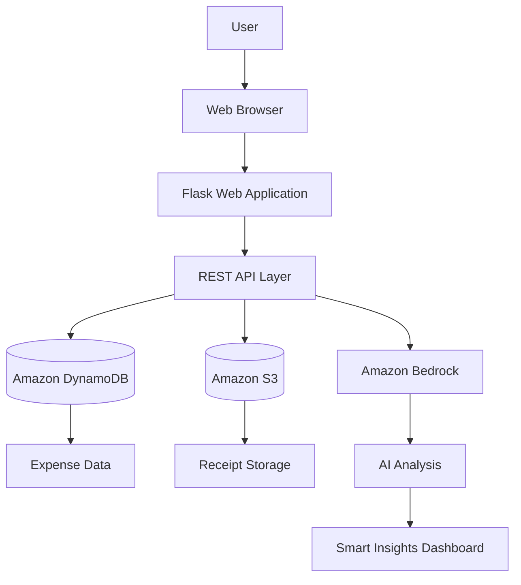

# Architecture Documentation

## Overview

The AI-Powered Smart Expense Analyzer is a cloud-native web application built with a Flask backend, DynamoDB for data storage, S3 for file storage, and Amazon Bedrock for AI-generated insights.

## High-Level Architecture Diagram

## Component Breakdown

### 1. Client Layer
- HTML5 + CSS3 + Bootstrap 5 + vanilla JavaScript.
- Chart.js renders category, payment method, monthly, and daily spending charts.
- Communicates with the backend exclusively via `fetch()` calls to REST JSON APIs.

### 2. Application Layer (Flask)
- `app.py` is the single entry point, registering all route blueprints and serving both the HTML pages and REST API.
- Routes are organized by domain: `auth_routes.py`, `expense_routes.py`, `analytics_routes.py`, `ai_routes.py`, `upload_routes.py`.
- Business logic lives in the `services/` layer, keeping routes thin and easy to read.

### 3. Data Layer (Amazon DynamoDB)
- `ExpenseAnalyzerExpenses` table stores individual expense records, partitioned by `user_id` for fast per-user queries.
- `ExpenseAnalyzerUsers` table stores account records, with an `email-index` GSI for login lookups.
- A local in-memory fallback store (`services/dynamodb_service.py`) keeps the app fully working without an AWS account, for classroom demos.

### 4. Storage Layer (Amazon S3)
- Stores uploaded receipt images/PDFs, keyed per-user (`<user_id>/receipt_<id>.<ext>`).
- Presigned URLs provide temporary, secure access without making the bucket public.
- Falls back to local filesystem storage under `/uploads` when AWS is unavailable.

### 5. AI Layer (Amazon Bedrock)
- The backend aggregates a user's expense data into a structured JSON summary (totals, category breakdowns, monthly trends).
- This summary is sent as a prompt to a Bedrock text-generation model, which returns a structured spending analysis.
- If Bedrock is unreachable, a deterministic rule-based fallback analysis (in `services/bedrock_service.py`) generates equivalent insights from the same data using plain Python calculations.

### 6. Hosting Layer
- **AWS Elastic Beanstalk** (primary): serves the Flask app (frontend + API) from a single managed environment.
- **EC2** (alternative): manual deployment with Gunicorn + Nginx for more granular control.
- **IAM roles** attached to the compute environment grant least-privilege access to DynamoDB, S3, and Bedrock — no hard-coded credentials anywhere.

## Data Flow: Adding an Expense with a Receipt

1. User submits the "Add Expense" form (with an optional receipt file) from the browser.
2. Flask validates the input (`utils/validators.py`).
3. If a receipt is attached, `services/s3_service.py` uploads it to S3 and returns a key + presigned URL.
4. The expense record (amount, category, date, receipt URL, etc.) is written to DynamoDB via `services/dynamodb_service.py`.
5. The frontend redirects to the expense list, which fetches the updated data via `GET /api/expenses`.

## Data Flow: Generating AI Insights

1. User opens the AI Insights page.
2. The frontend calls `GET /api/ai/analyze`.
3. The backend loads all of that user's expenses from DynamoDB and computes a structured summary (`services/analytics_service.py`).
4. The summary is sent to Amazon Bedrock via `services/bedrock_service.py`.
5. Bedrock returns a structured, human-readable analysis, which is displayed on the dashboard along with a disclaimer.
6. If Bedrock fails or is disabled, the same summary is analyzed locally using rule-based logic, and the source is labeled accordingly.

## Security Model

- Passwords are hashed with Werkzeug's `generate_password_hash` (never stored in plain text).
- Sessions are server-side (Flask session cookies), scoped per logged-in user.
- All expense and analytics endpoints require an authenticated session (`@login_required` decorator) and only ever query data scoped to `session["user_id"]` — one user can never read another user's expenses.
- AWS credentials are never hard-coded; they come from IAM roles (production) or environment variables (local development).
